# Hybrid Images

The goal of this project is to create [hybrid images](http://olivalab.mit.edu/hybrid_gallery/gallery.html) using the approach described in this SIGGRAPH 2006 [paper](http://olivalab.mit.edu/publications/OlivaTorralb_Hybrid_Siggraph06.pdf) by Oliva, Torralba, and Schyns. Hybrid images are static images that change in interpretation as a function of the viewing distance. The basic idea is that high frequency tends to dominate perception when it is available, but, at a distance, only the low frequency (smooth) part of the signal can be seen. By blending the high frequency portion of one image with the low-frequency portion of another, you get a hybrid image that leads to different interpretations at different distances. This project is based on this [assignment](https://yxw.cs.illinois.edu/course/CS445/Content/projects/hybrid/ComputationalPhotography_ProjectHybrid.html) in computational photography at UIUC in spring 2023.

## Table of Contents
1. [Hybrid Image Main Result](#hybrid-image-main-result)
    1. [Fast Fourier Transforms of Images](#fast-fourier-transforms-of-images)
    1. [Laplacian and Gaussian Pyramids of Hybrid Images](#laplacian-and-gaussian-pyramids-of-hybrid-images)
    1. [Hybrid Images in Color](#hybrid-images-in-color)
1. [Other Hybrid Images](#other-hybrid-images)
    - [Dog and Woman](#dog-and-woman)
    - [Crow and T-Rex](#crow-and-t-rex)
    - [Pile of Legos and Lego Building](#pile-of-legos-and-lego-building)
1. [Acknowledgments/Attributions](#acknowledgmentsattributions)

## Hybrid Image Main Result
A hybrid image works by superimposing two images – one filtered with a low-pass filter and the other filtered with a high-pass filter. The hybrid image looks like the high-passed filtered image when viewed at close distances, and it looks like the low-passed filtered image when viewed from a distance. The basic idea behind this effect is that high frequency tends to dominate perception when it is available, but, at a distance, only the low frequency (smooth) part of the signal can be seen. Essentially, we are subsampling the scene when viewed from far away.

In the example below, the Statue of Liberty is filtered with a low pass filter with $\sigma=20$, and the red panda is filtered with a high-pass filter with $\sigma=10$. The hybrid image looks like the red panda when viewed up close, but it looks like the Statue of Liberty when viewed from far away. Hybrid images demonstrates that visual processing is dominated by a particular frequency band in the spatial domain when viewing an image from a given distance.

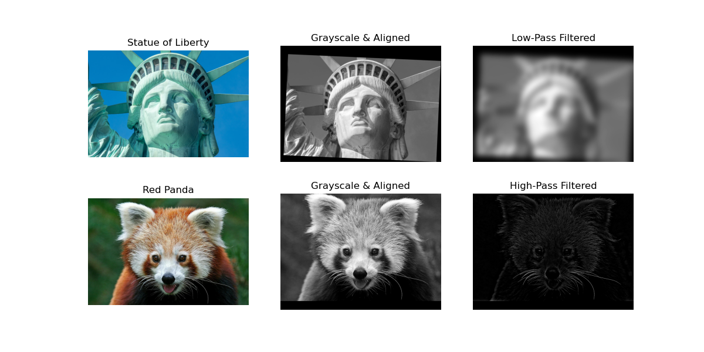

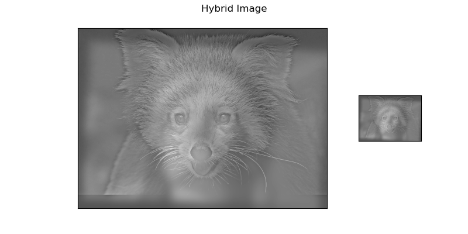

The hybrid image is plotted twice at different sizes to simulate viewing the image from different distances. Step away from your computer to see the full effect!

[Back to top](#table-of-contents)
 
 

### Fast Fourier Transforms of Images

The Statue of Liberty is filtered with a low-pass filter, which removes high frequencies from the image. The red panda is filtered with a high-pass filter, which remove low frequencies from the image. When the low-passed and high-passed images are combined, the resulting image has the low frequencies of the Statue of Liberty and the high-frequency details of the red panda. Therefore, one sees the low-frequency details of the Statue of Liberty at close distances and sees the high-frequency details of the red panda when viewed from a distance. 

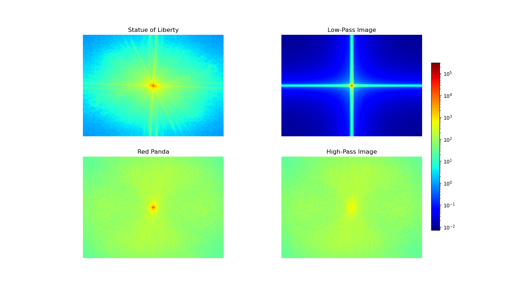

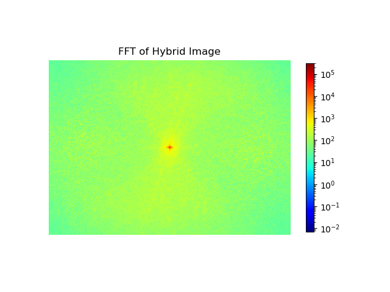

[Back to top](#table-of-contents)
 
 

### Laplacian and Gaussian Pyramids of Hybrid Images

The Gaussian pyramid is constructed by blurring the image with a low-passed filter. The subsequent levels of the pyramid are created by subsampling the blurred image by a factor of two and then filtering. Lower levels of the Gaussain pyramid only show the the low-frequency signals of the hybrid image - the Statue of Liberty.

The Laplacian pyramid is constructed by subtracting the unit impulse from each level of the Gaussian pyramid. The higher levels of the Laplacian pyramid show the high-frequency details of the hybrid image, which is the red panda.

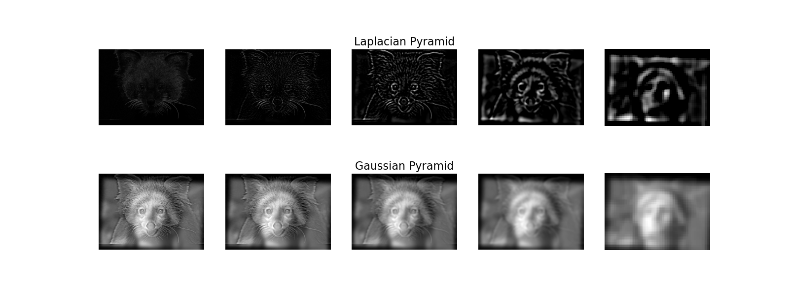

[Back to top](#table-of-contents)
 
 

### Hybrid Images in Color

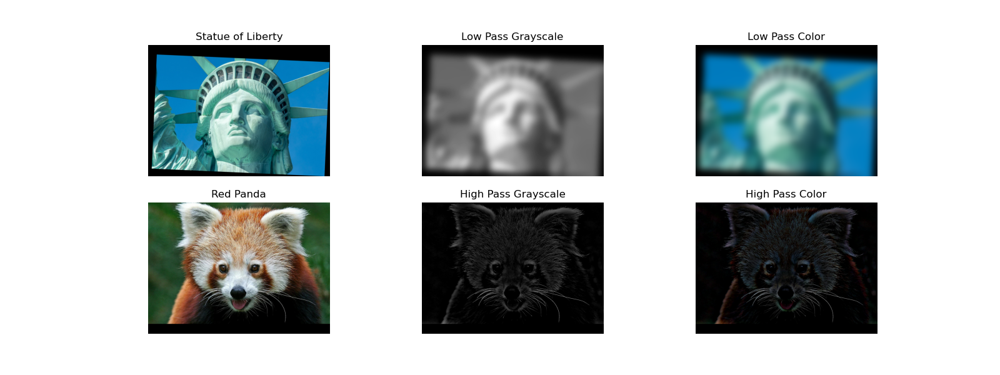

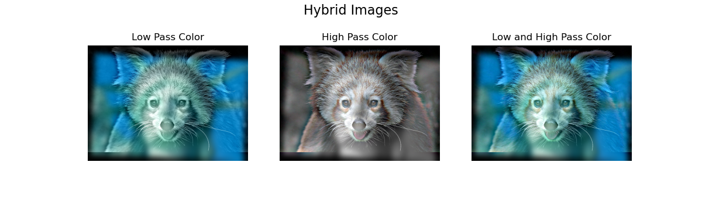

[Back to top](#table-of-contents)
 
 

## Other Hybrid Images

 

### Dog and Woman
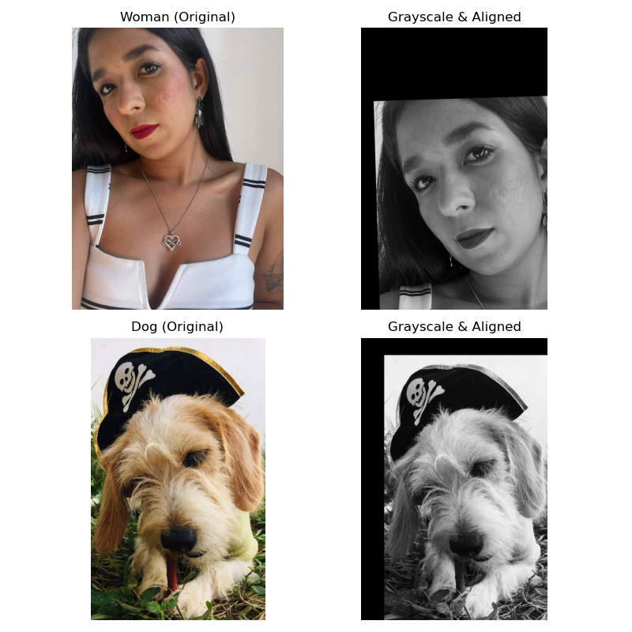

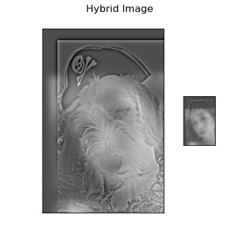

[Back to top](#table-of-contents)
 
 

### Crow and T-Rex
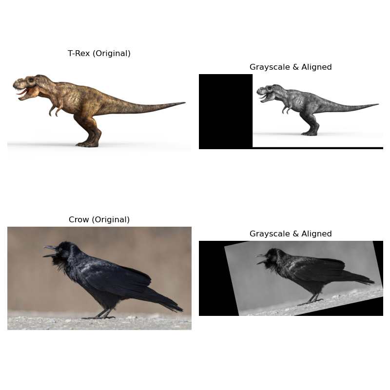

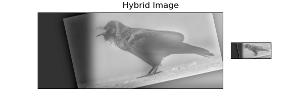

[Back to top](#table-of-contents)
 
 

### Pile of Legos and Lego Building

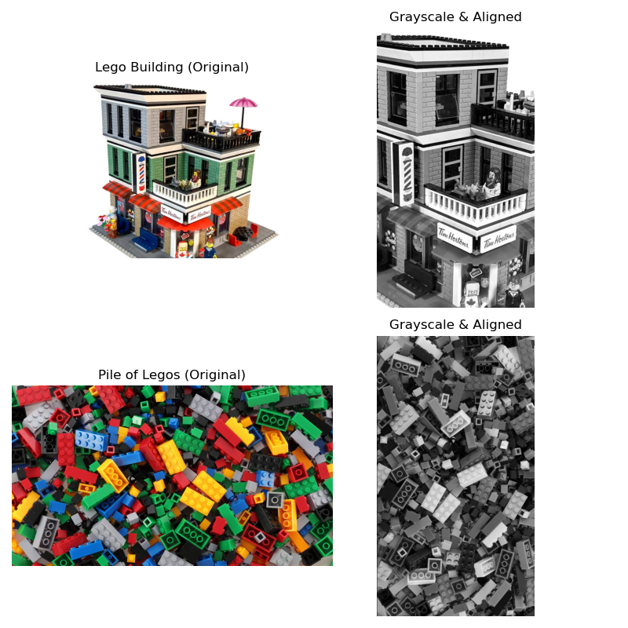

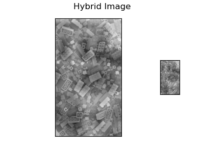

[Back to top](#table-of-contents)
 
 

## Acknowledgments/Attributions

- [Crow](https://www.audubon.org/field-guide/bird/fish-crow)
- [T-rex](https://www.renderhub.com/creativejungle/realistic-trex-dinosaur-3d-model)
- [Lego Building](https://ideas.lego.com/projects/5b1bbbac-4a84-4050-adde-3cef6d6bd45e)         
- [Pile of Legos](https://www.cnn.com/2022/06/18/opinions/lego-90th-anniversary-toys-schwartz/index.html)
- [Red Panda](https://www.zoo-leipzig.de/en/animal/red-panda/)  
- [Statue of Liberty](https://mymodernmet.com/statue-of-liberty-facts/) 

[Back to top](#table-of-contents)
